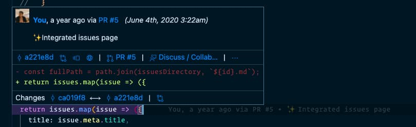
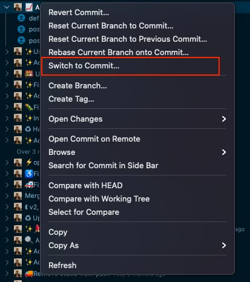
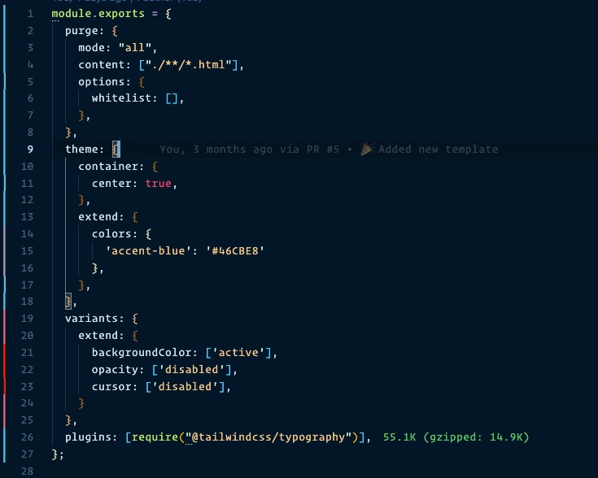

This post will discuss some of my favorite features of the [GitLens VSCode extension](https://marketplace.visualstudio.com/items?itemName=eamodio.gitlens) that might help you optimize your git workflow in VSCode.




Although VSCode has pretty good [built-in git tools](https://code.visualstudio.com/docs/editor/versioncontrol) for basic git stuff like adding, committing, pushing, changing/creating branches. But if you want some additional features and want to "Supercharge your git workflow," then GitLens is possibly the best extension out there for this.

GitLens lets you do almost everything with git that you could imagine, directly from your code editor with a friendly GUI. I would go as far as to say that it even does stuff that I didn't even know was possible with git.

So here are some of my favorite GitLens features that I use regularly. You can find the [full list of the features here](https://gitlens.amod.io/#features).




This is probably the first feature you will notice when you install the extension. As soon as you hover over any line in the code (in a project using git and has some commits), you will be able to see this popover.



This popover gives you almost all the information that you might need for the current line like, what did the line looked like before the most recent commit that affected it, the commit hash that introduced the change, the PR that introduced the change (would need to connect to GitHub for this one), etc.

If you click on the open changes button, you will be able to view all the changes introduced by that commit in the current file.


Clicking on the commit hash in the popup gives you many options for that commit, like resetting, switching, or creating a branch from the commit, etc.




This is also a neat feature that allows you to view which lines were intrduced by which commit and author for a particular file. This can be useful for exploring the history of the file and answering questions about which commit/PR introduced a particular set of changes and who made those commits.

To toggle file blame, you can either use the [VSCode command palette](https://code.visualstudio.com/docs/getstarted/userinterface#_command-palette) (Cmd + Shift + P) and search for "GitLens: Toggle file blame" or use the keyboard shortcut (Option + Cmd + G  B) to open it.


Once you are in the file blame mode, you can select the commits from the sidebar that appears next to the gutter to explore the changes introduced by that commit.




After you install the extension it adds a new menu for some quick actions in your sidebar as well.

Although there are many sections in its sidebar menu, like repositories, file history, line history, etc., the one I use most often is the commits view.

It shows you all the commits of the current branch and again allows you to do a bunch of stuff like exploring the changed files in the commit, the PR that introduced the commit, etc.


If you right-click on a particular commit, you can take some actions over the commit like reset the commit, compare it with head, and, the one I use most often, switch to commit, which checks out the commit so you can explore the project in that commit state






The usefulness of this feature might be arguable, but it is pretty cool, so I thought it deserved a spot on this list.

File heatmap shows you the spots in the file that have been changed most recently by adding a heatmap on the edge of the gutter. To enable it, search for "GitLens: Toggle File heatmap" via the  [VSCode command palette](https://code.visualstudio.com/docs/getstarted/userinterface#_command-palette) (Cmd + Shift + P).



Redder color means changes were made very recently in that area. Again you can fully customize age thresholds, locations, the color of the most recent and least recent changes, etc., [from the settings](https://github.com/eamodio/vscode-gitlens#gutter-heatmap-settings-).




Last but not least, GitLens also comes with a user-friendly interactive rebase editor, which lets you easily drop, squash re-order your commits during an [interactive git rebase session](https://git-scm.com/book/en/v2/Git-Tools-Rewriting-History).

This is an excellent tool for interactive rebases if you, like me, hate the vi editor that appears during interactive rebase with git.


To use this directly from your terminal (e.g., when you use `git rebase -i` ), run the following command to set VS Code as your git rebase editor - 

```bash
git config --global core.editor "code --wait"
```




GitLens helps you better understand your code by "Supercharging," the git abilities build into VS Code. It allows you to explore the history and evolution of a codebase effortlessly.

With the features I explained here, I have barely scratched the surface of what this extension can do, and even I haven't explored most of the features yet, so feel free to share in the comments below if you find something interesting that deserves to be in the list.