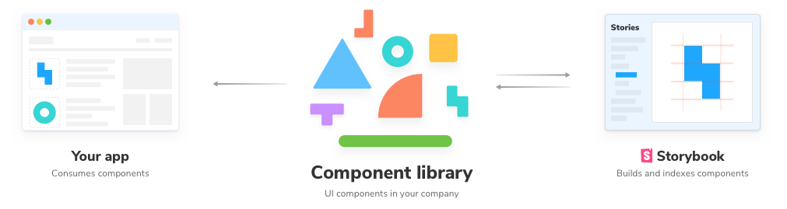
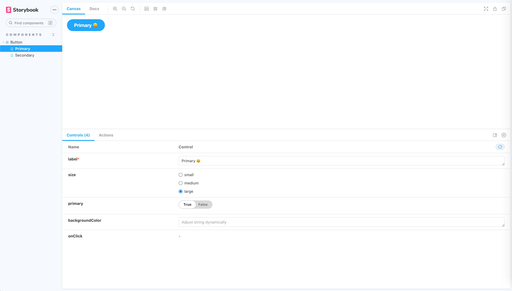
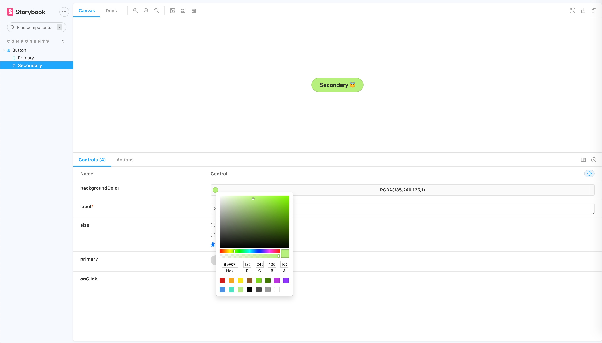

If you have multiple projects that are using the same design system (inputs, buttons, other reusable components, etc.), then you probably have a good enough use case to create a shared component library that can be published and consumed directly by all your projects.

Another benefit is that you can develop UI components easily in isolation and render their different states directly, without needing to mess with the business logic in your dev stack, with the help of [Storybook](https://storybook.js.org/).



In this tutorial, I would be covering the steps for creating and publishing a React component library ([Storybook supports countless other frontend frameworks](https://storybook.js.org/)), with the following steps -

1. [Setting up the project](#setting-up-the-project)
2. [Installing Storybook](#installing-storybook)
3. [Adding stories and setting up the file structure](#adding-stories-and-setting-up-the-file-structure)
4. [Compiling the Library using Rollup](#compiling-the-library-using-rollup)
5. [Publishing and consuming the library](#publishing-and-consuming-the-library)

<h2 id="setting-up-the-project">Setting up the project</h2>

Since we are building a component library that would be published to a package manager like NPM, we would be better off if we setup React from scratch instead of using something like create-react-app, which is better suited for web applications.

> If you have a component library using React already setup, then you can directly move forward to the next step. We just need a basic React setup before we can install Storybook.

For that, create a new folder with whatever name you want for your component library. I would be calling mine my-awesome-component-library. 

Then run [`yarn init`](https://classic.yarnpkg.com/en/docs/cli/init/) and [`git init`](https://github.com/git-guides/git-init), respectively, in that folder providing appropriate values for the fields asked. This would initialize an empty NPM project with git. Also, [set up a gitignore file](https://docs.github.com/en/free-pro-team@latest/github/using-git/ignoring-files).

We are building a React component library, so we would need to React to build our components. Also, we are going to use [TypeScript to build our library](https://prateeksurana.me/blog/react-library-with-typescript/#why-typescript). Let's add that too.

```jsx
yarn add --dev react react-dom @types/react typescript
```

Since `react` requires that we need to have a single copy of `react-dom`, we will be adding it as a [peerDependency](https://flaviocopes.com/npm-peer-dependencies/) so that our package always uses the installing client's version. Add the following snippet to your package.json.

```json
...
"peerDependencies": {
    "react": "^16.8.0",
    "react-dom": "^16.8.0"
 },
...
```

As one last step for setting up the project, let's also add a `tsconfig` for compiling our TypeScript. Create a file called `tsconfig.json` in the root and add the following to it.

```json
{
    "compilerOptions": {
      "target": "es5",
      "outDir": "lib",
      "lib": [
        "dom",
        "dom.iterable",
        "esnext"
      ],
      "declaration": true,
      "declarationDir": "lib",
      "allowJs": true,
      "skipLibCheck": true,
      "esModuleInterop": true,
      "allowSyntheticDefaultImports": true,
      "strict": true,
      "forceConsistentCasingInFileNames": true,
      "module": "esnext",
      "moduleResolution": "node",
      "resolveJsonModule": true,
      "isolatedModules": true,
      "noEmit": true,
      "jsx": "react"
    },
    "include": [
      "src"
    ],
    "exclude": [
        "node_modules",
        "lib"
    ]
  }
```

These options help TypeScript to [ignore and enforce certain rules while compiling our code](https://prateeksurana.me/blog/react-library-with-typescript/#setting-up-typescript-config). You can [check out all the flags available in the docs](https://www.typescriptlang.org/tsconfig).

[GitHub: Code till this step](https://github.com/prateek3255/my-awesome-component-library/tree/0f3932074fea5e97b2aaab6d31a794b4ef937514)

<h2 id="installing-storybook">Installing Storybook</h2>

Now that we have the React boilerplate ready we can now install Storybook, run the following command in the root folder to add Storybook to your project

```json
npx sb init
```

This command will install all the core `devDependencies`, add scripts, setup some configuration files, and create example stories for you to get [you up and running with Storybook](https://storybook.js.org/docs/react/get-started/install). At the time of writing this article, I am using Storybook version 6.1.9

You can now run `yarn storybook` and that should boot up Storybook for you with the examples they created for you.

Once you are done playing with the example, you can go ahead and safely delete the stories folder.

Now open the `.storybook/main.js` file. This file controls the behavior of your Storybook server by specifying the [configuration for your stories](https://storybook.js.org/docs/react/configure/overview#configure-your-storybook-project).

Update the stories key in the file to this -

```json
...
"stories": [
    "../src/**/*.stories.tsx"
 ],
...
```

This config would run TypeScript stories defined in the `src` folder, which we would be creating in the next step.

[GitHub: Code till this step](https://github.com/prateek3255/my-awesome-component-library/tree/f758d09f8df37268387f0b47987a91ff820a7ed7)

<h2 id="adding-stories-and-setting-up-the-file-structure">Adding stories and setting up the file structure</h2>

Now that we have the Storybook setup, we can start creating our components and writing stories for them.

But first of all what are stories anyways?

Glad you asked, [from the docs](https://storybook.js.org/docs/react/get-started/whats-a-story) -

"A story captures the rendered state of a UI component. Developers write multiple stories per component that describe all the “interesting” states a component can support."

In short, Stories let you render the different states of your UI component and lets you play with the different states with something called [Storybook Controls](https://storybook.js.org/docs/react/essentials/controls), which we will get to in a minute. These are development only files and hence won't be included in our final library bundle.

Let's create a demo component to check out how stories work and how you can make the most out of it.

Our file structure would look something like this - 

```bash
.storybook/
  main.js
	preview.js
.gitignore
package.json
rollup.config.js
tsconfig.json
src/
	components/
	  MyAwesomeComponent/
	    MyAwesomeComponent.tsx
	    MyAwesomeComponent.css
	    MyAwesomeComponent.stories.tsx
		  index.ts
  index.ts
```

We will be using the same button component that Storybook gave us with the demo earlier for demonstrating.

Create a folder `src/components/Button` and paste the [Button.tsx,](https://github.com/prateek3255/my-awesome-component-library/blob/af7ef6715e006db4c5a2f6fecb6212a0fc928d0a/src/components/Button/Button.tsx) [button.css](https://github.com/prateek3255/my-awesome-component-library/blob/af7ef6715e006db4c5a2f6fecb6212a0fc928d0a/src/components/Button/button.css), and [index.ts](https://github.com/prateek3255/my-awesome-component-library/blob/af7ef6715e006db4c5a2f6fecb6212a0fc928d0a/src/components/Button/index.ts) files in it.

Lets add some stories ✨

Create `src/components/Button/Button.stories.tsx` 

Now add the following default export to it -

```jsx
import React from "react";
import { Meta } from "@storybook/react/types-6-0";
import Button, { ButtonProps } from "./Button";

export default {
  title: "Components/Button",
  component: Button,
} as Meta;
```

The [default export in a story](https://storybook.js.org/docs/react/writing-stories/introduction#default-export) defines the meta information that will be used by Storybook and its addons.

To define a Story you [need to create named exports](https://storybook.js.org/docs/react/writing-stories/introduction#defining-stories) in the file, so for example we can create a story for the primary button type like this.

```jsx
export const PrimaryButton = () => <Button label="Hello world" primary />;
```

To simplify writing multiple stories, Storybook provides an option to create stories by [defining a master template and reusing that template for each story.](https://storybook.js.org/docs/react/writing-stories/introduction#using-args) So in our case, the stories for Primary and Secondary type buttons can be created like this -

```tsx
import React from "react";
import { Meta } from "@storybook/react/types-6-0";
import { Story } from "@storybook/react";
import { Button, ButtonProps } from "./Button";

export default {
  title: "Components/Button",
  component: Button,
} as Meta;

// Create a master template for mapping args to render the Button component
const Template: Story<ButtonProps> = (args) => <Button {...args} />;

// Reuse that template for creating different stories
export const Primary = Template.bind({});
Primary.args = { label: "Primary 😃", size: "large" };

export const Secondary = Template.bind({});
Secondary.args = { ...Primary.args, primary: false, label: "Secondary 😇" };
```

If you haven't already, you can restart the Storybook server by rerunning `yarn storybook`, and you should see the following. 



Notice that Storybook automatically generated the controls, according to the component props, for us. This is thanks to [react-docgen-typescript, which is used by Storybook to infer the argTypes for a component](https://storybook.js.org/docs/react/api/argtypes#automatic-argtype-inference). One more reason to use TypeScript.

Apart from using auto-generated controls, you can also define [custom controls](https://storybook.js.org/docs/react/essentials/controls#configuration) for some or all props using the `argTypes` key. For example, let's define a custom color picker for the `backgroundColor` prop, replace the default export in the stories file with this -

```tsx
export default {
  title: "Components/Button",
  component: Button,
  argTypes: {
    backgroundColor: { control: 'color' },
  },
} as Meta;
```

The current story preview also looks a bit weird with the button in one corner of the preview. As one last step, [add the `layout: 'centered'` key](https://storybook.js.org/docs/react/configure/story-layout) to the `.storybook/preview.js` file to center the preview. This file lets you control how your [story is rendered in the Storybook.](https://storybook.js.org/docs/react/configure/overview#configure-story-rendering)

If you followed the above steps, your final story preview would look something like this -



[GitHub: Code till this step](https://github.com/prateek3255/my-awesome-component-library/tree/af7ef6715e006db4c5a2f6fecb6212a0fc928d0a)

<h2 id="compiling-the-library-using-rollup">Compiling the Library using Rollup</h2>

Now that you know how to build components with Storybook, it's time to move to the next step, which is compiling our library so that our end applications can consume it.

If you're not familiar with Rollup and wondering why we are using it to compile our library instead of something like webpack, that's because [Rollup is best suited for bundling libraries, whereas webpack is suited for apps](https://medium.com/webpack/webpack-and-rollup-the-same-but-different-a41ad427058c).

First, we would need to create an entry file that would export all the components for our component library. Create `src/index.ts`, and since our component library only has one component right now, it would look something like this -

```tsx
import Button from "./components/Button";

export { Button };
```

Let's add rollup, run the following to install Rollup and its plugins that we'll be using to bundle the library -

```bash
yarn add --dev rollup rollup-plugin-typescript2 @rollup/plugin-commonjs @rollup/plugin-node-resolve rollup-plugin-peer-deps-external rollup-plugin-postcss postcss
```

Now before we add the rollup config, there are a few types of JavaScript modules that you should be aware of - 

- [CommonJS](https://nodejs.org/docs/latest/api/modules.html#modules_modules_commonjs_modules) - This the module format used by Node and webpack <2 (using the `require` function). Even though we are publishing a React module, we need to consider that it might also be used within an SSR (Server side rendering) environment, which generally uses Node.
- [ESM](https://nodejs.org/api/esm.html#esm_modules_ecmascript_modules) - This is the modern module format that we normally use in our React applications in which modules are defined using a variety of import and export statements. The main benefit of shipping ES modules is that it [makes your library tree-shakable](https://bitsofco.de/what-is-tree-shaking/). This is supported by tools like Rollup and webpack 2+
- [UMD](https://riptutorial.com/javascript/example/16339/universal-module-definition) - This module format is not as popular these days. It is required when the user requires our module using a script tag.

So we would want to support both ESM and CommonJS modules for our component library so that all kinds of support tools can use it in the end application that relies on either of the module types.

To do that, `package.json` allows adding the entry points for both ESM and CommonJS modules via the module and main key, respectively. So add the following to keys to your `package.json` -

```json
{ 
  ...
  "main": "lib/index.js",
  "module": "lib/index.esm.js",
  "types": "lib/index.d.ts",
  ...
}
```

The types key would point to the static types generated for your library via Rollup, which would help with [IntelliSense in code editors like VSCode.](https://code.visualstudio.com/docs/languages/typescript#_intellisense)

Its time to add the Rollup config file now, create a file called `rollup.config.js` in the root folder and add the following to it -

```jsx
import peerDepsExternal from "rollup-plugin-peer-deps-external";
import resolve from "@rollup/plugin-node-resolve";
import commonjs from "@rollup/plugin-commonjs";
import typescript from "rollup-plugin-typescript2";
import postcss from "rollup-plugin-postcss";

const packageJson = require("./package.json");

export default {
  input: "src/index.ts",
  output: [
    {
      file: packageJson.main,
      format: "cjs",
      sourcemap: true
    },
    {
      file: packageJson.module,
      format: "esm",
      sourcemap: true
    }
  ],
  plugins: [
    peerDepsExternal(),
    resolve(),
    commonjs(),
    typescript({ useTsconfigDeclarationDir: true }),
    postcss({
        extensions: ['.css']
    })
  ]
};
```

Let's break it down one by one to figure out what's happening here. 

To start with, the [input key](https://rollupjs.org/guide/en/#input) indicates the entry point for Rollup for our component library, which is the `index.js` file that we just created, which contains the exports for all our components.

The output key indicates what types of output files will be generated at which place. As mentioned previously, we would be building the ESM and CommonJS bundles, and we read the output files for both bundles from the `package.json`.

Lastly there is the plugin array with which we are using the following plugins -

- [rollup-plugin-peer-deps-external](https://www.npmjs.com/package/rollup-plugin-peer-deps-external) - This plugin avoids us from bundling the `peerDependencies` (react and react-dom in our case) in the final bundle as these will be provided by our consumer application.
- [@rollup/plugin-node-resolve](https://www.npmjs.com/package/@rollup/plugin-node-resolve) - This plugin includes the third-party external dependencies into our final bundle (we don't have any dependencies for this tutorial, but you'll definitely need them as your library grows).
- [@rollup/plugin-commonjs](https://www.npmjs.com/package/@rollup/plugin-commonjs) - This plugin enables the conversion to CJS so that they can be included in the final bundle
- [rollup-plugin-typescript2](https://www.npmjs.com/package/rollup-plugin-typescript2) - This plugin compiles the TypeScript code to JavaScript for our final bundle and generates the type declarations for the `types` key in `package.json`. The `useTsconfigDeclarationDir` option outputs the types to the directory specified in the `tsconfig.json` file.
- [rollup-plugin-postcss](https://www.npmjs.com/package/rollup-plugin-postcss) - This plugin helps include the CSS that we created as separate files in our final bundle. It does this by generating minified CSS from the *.css files and includes them via the `<head>` tag wherever used in our components.

Now as one last step let's add the script to build our component library, add the following script to your `package.json` file -

```json
{
 ...
 "scripts": {
    ...
    "build": "rollup -c"
 },
 ...
}
```

Go ahead and run `yarn build` from your terminal and you should be able to see the `lib` folder created. I would recommend exploring this folder further to understand how Rollup and its plugins generate the appropriate bundles for the CommonJS and ESM modules with the type definitions.

Don't forget to add the `lib` folder to `.gitignore`.

[GitHub: Code till this step](https://github.com/prateek3255/my-awesome-component-library/tree/8c5aab293f894c2e8e6416b4f522024f6d7c3585)

<h2 id="publishing-and-consuming-the-library">Publishing and consuming the library</h2>

Publishing the library to NPM couldn't be any easier. Since we have already defined all the required fields in `package.json`, you just need to run `npm publish`.

Once published, you should be able to import your component from your library in the consumer application just like this -

```jsx
import { Button } from "my-awesome-component-library";
```

You can also refer to my [another article for the detailed steps and best practices for publishing a library to NPM.](https://prateeksurana.me/blog/react-library-with-typescript/#getting-ready-for-publishing)

You might also want to keep your library private. If you have multiple projects in a [monorepo](https://www.toptal.com/front-end/guide-to-monorepos) and are using something like [yarn workspaces](https://classic.yarnpkg.com/en/docs/workspaces/), then you don't actually need to publish the package anywhere.

Place the library folder in your monorepo and add it to your workspaces array to the package.json in the root folder - 

```json
// package.json
{
  ... 
	"workspaces": [
			...
			"my-awesome-component-library"
	],
	...	
}
```

Then you can directly access it from any other package in your workspace by just adding it as an dependency:

```json
// my-awesome-frontend/package.json
{
  ... 
	"dependencies": {
			...
			"my-awesome-component-library": 1.0.0,
			...
	},
	...	
}
```

## Next Steps

- Integrate [Netlify](https://www.netlify.com/) or some other service to automatically deploy the Storybook whenever a PR is merged into master and to generate pull previews whenever a new PR is opened.
- Setup test cases [using React Testing library and Jest](https://www.pluralsight.com/guides/how-to-test-react-components-in-typescript).
- Add [code-splitting](https://github.com/rollup/rollup-starter-code-splitting) to let the consumer application import only the required components instead of the whole library.

If this post helped you in anyway then do [share it on twitter,](https://twitter.com/intent/tweet?url=https%3A%2F%2Fprateeksurana.me%2Fblog%2Freact-component-library-using-storybook-6%2F&text=Creating%20a%20React%20component%20library%20using%20Storybook%206%20by%20@psuranas) and [follow me](http://twitter.com/psuranas) for more.